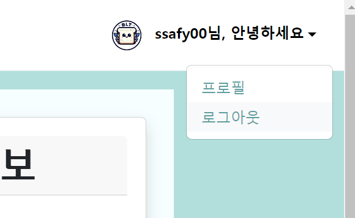
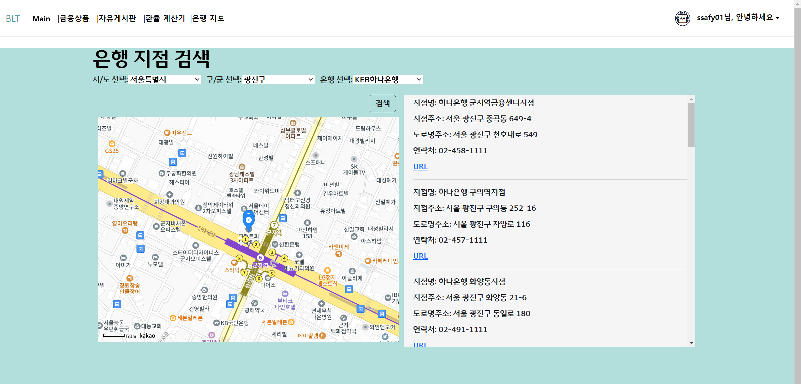
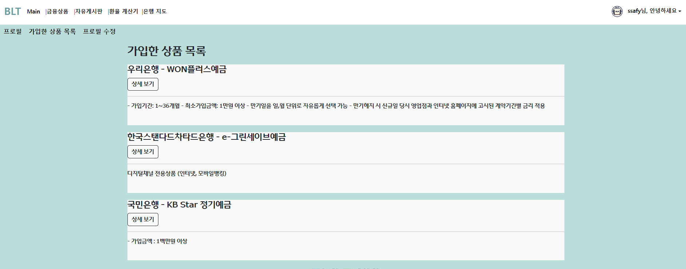

# 목차

1. [팀원 정보 및 업무 분담 내역](# <팀원 정보 및 업무 분담 내역>)

2. [설계 내용(아키텍처 등) 및 실제 구현정도](# <설계 내용(아키텍처 등) 및 실제 구현정도>)

3. [데이터베이스 모델링(ERD)](# <데이터베이스 모델링(ERD)>)

4. [금융 상품 추천 알고리즘에 대한 기술적 설명](# <금융 상품 추천 알고리즘에 대한 기술적 설명>)

5. [서비스 대표 기능들에 대한 설명](# <서비스 대표 기능들에 대한 설명>)

6. [기타(느낀 점, 후기 등](# <기타(느낀 점, 후기 등)>)

---------

# <팀원 정보 및 업무 분담 내역>

| 팀원      | 업무(Front End)                                                               | 업무 (Back End)                               |
|:-------:|:---------------------------------------------------------------------------:|:-------------------------------------------:|
| 노진서(팀장) | 회원가입, 로그인, 프로필 페이지, 프로필 수정, 환율 계산기, 은행 지도                                   | 회원 커스터마이징(account), 환율(exchange),           |
| 박주영     | 프로필 가입상품목록(가입, 회원탈퇴), 환율 계산기,메인화면, 메인화면, 상품추천, 금융상품(예적금 금리 비교), 자유게시판(CRUD) | 금융상품, 상품추천 모델(financial), 게시물 및 댓글(article) |

---------

# <설계 내용(아키텍처 등) 및 실제 구현정도>

---------

### Mockup

# <데이터베이스 모델링(ERD)>

---------

# <금융 상품 추천 알고리즘에 대한 기술적 설명>

### 1. 비로그인 상태

비로그인 상태에서는 사용자의 개별적인 정보를 받을 수 없기 때문에, 예금과 적금에 대한 금융 상품 추천을 다음과 같은 방식으로 수행합니다

- **예금 상품 추천**:
  - 다양한 예금 상품들의 옵션을 분석합니다. 각 상품은 계약 기간, 기준 금리, 최고 우대 금리 등의 옵션을 가지고 있습니다.
  - 예금 상품 중에서 최고 우대 금리가 가장 높은 두 개의 상품을 선택하여 추천합니다.
- **적금 상품 추천**:
  - 다양한 적금 상품들의 옵션을 분석합니다. 각 상품은 계약 기간, 기준 금리, 최고 우대 금리 등의 옵션을 가지고 있습니다.
  - 적금 상품 중에서 최고 우대 금리가 가장 높은 두 개의 상품을 선택하여 추천합니다.

이 방식은 모든 사용자가 공통적으로 가장 유리한 금리 혜택을 받을 수 있는 상품을 추천하는 것을 목표로 합니다.

### 2. 로그인 상태

로그인 상태에서는 사용자의 개인 정보를 활용하여 보다 맞춤화된 금융 상품 추천을 수행합니다

- **개인 데이터 수집**: 10,000개의 토이 유저 데이터를 기반으로 유저의 나이, 성별, 자산, 연봉 등의 데이터를 수집합니다.

- **데이터 정제**:
  
  - 회원당 여러 개의 금융 상품을 가지고 있거나, 상품을 가입하지 않은 회원들에 대한 데이터를 처리합니다.
  - 빈 값(누락된 값)을 제거하고, 한 레코드(한 행)당 하나의 금융 상품만 들어갈 수 있도록 데이터 정제를 수행합니다.

- **랜덤 포레스트 모델을 이용한 예측**:
  
  - 수집된 개인 데이터를 바탕으로 랜덤 포레스트 모델을 사용하여 다변량 단일 분류 모델을 구축합니다.
  - 이 모델은 다양한 독립 변수(나이, 성별, 자산, 연봉 등)를 기반으로, 사용자가 가입할 가능성이 높은 금융 상품을 예측합니다.

- **상품 추천**:
  
  - 모델을 통해 예측된 결과를 바탕으로 해당 회원에게 가장 적합한 금융 상품 상위 5개를 추천합니다.

---------

# <서비스 대표 기능들에 대한 설명>

### 1. 메인페이지(금융상품 추천)

- 로그인 시

로그인 시 랜텀포레스트모델로 학습시킨 모델을 기반으로 금융상품 추천을 메인화면에 Carousel로 보여줍니다.

상세 정보 또한 확인이 가능합니다.

* 비 로그인 시

비 로그인 시 예금과 적금 상품 중에 금리가 가장 높은 상품들로 보여줍니다.

### 2. 로그인, 회원가입, 로그아웃

django의 회원 관리 라이브러리(allauth& dj-rest-auth) 등을 사용하여 Django의 기본 User 를 상속받아 커스텀 User 를 구현했습니다. 커스텀 User와 Serializer를 활용하여 유저이름, 이메일, 가입한 상품 목록 등을 필요한 데이터를 저장할 수 있는 필드를 추가했습니다.

- 로그인

비로그인 상태일 때, 기본 이미지와 함께 '안녕하세요, 익명님'으로 이름이 네비게이션에 출력되며, 해당 영역을 클릭하면 네비게이션 탭에서 회원가입과 로그인이 보입니다.

아래는 비로그인 상태에서 로그인탭 클릭시 보이는 화면입니다. 

- 회원가입

아래는 비로그인 상태에서 회원가입탭 클릭시 보이는 화면입니다.

- 로그아웃

로그인 상태일 때, 네비게이션에 유저의 프로필 사진이 있을 경우 유저의 프로필사진과 유저이름이 출력됩니다. 유저가 따로 프로필사진을 올리지 않았을 경우는 기본 이미지로 출력됩니다. 

유저의 프로필사진이나 유저 이름이 있는 영역을 클릭하면 네비게이션 탭에 프로필과 로그아웃이 보입니다.

아래는 로그인 상태에서 로그아웃 탭 클릭시 로그아웃이 진행되고 보이는 화면입니다.

### 3. 예적금 금리 비교

* 전체 조회
  
  
  
  원하는 상품이 적금인지 예금인지 선택한 후, 원하는 은행을 선택하고 계약 기간을 지정하면, 해당 금융 상품 목록을 화면에 표시합니다.

* 상세 조회
  
  
  
  상세 조회를 통해 해당 상품의 상세 정보를 확인할 수 있습니다. 
  
  - 가입성공
  
  
  
  또한 해당 페이지에서 상품 가입하기가 가능합니다.
  
  - 가입 취소
  
  가입취소 또한 가능합니다.

### 4. 환율 계산기

현재 환율에 대한 정보를 가져오기 위해  [한국수출입은행 환율정보 API ](https://www.koreaexim.go.kr/ir/HPHKIR020M01?apino=2&viewtype=C&searchselect=&searchword=) 를 활용했습니다.

프론트엔드(Vue) 에서 환율 API 에 요청을 보내면 CORS 에러가 발생하기 때문에 백엔드에서 데이터를 가져와 프론트로 전달할 수 있도록 구성했습니다. 

• [프론트엔드] 화면 접속 시 백엔드로 데이터 요청
• [백엔드] 환율 API 에 데이터 요청
• [백엔드] 환율 API 를 통해 받아온 데이터를 프론트로 전송
• [프론트엔드] 백엔드를 통해 받아온 데이터를 화면에 출력

환율 계산기를 통해 해당 국가를 선택하면 원화와 해당국가 화폐를 서로 양방향으로 가치 비교가 가능합니다.

### 5. 근처 은행 검색

[Kakao Maps API](https://apis.map.kakao.com/) 를 활용하여 지도를 표시합니다.
select option으로 시/도를 선택하면 그 값에 따라 구/군이 선택가능합니다. 

검색버튼을 누르면 시/도와 구/군, 은행을 선택한 결과를 합쳐 카카오API에서 키워드 검색을 합니다. 해당 위치 근처의 은행 정보를 적절하게 출력합니다.

### 6. 커뮤니티(게시판)

- 게시물 전체 조회
  
  
  
  전체 게시물 조회 해줍니다. 해당 페이지에서 각 게시물의 상세페이지에 접속할 수 있고, 또한 게시물 생성이 가능합니다.

- 게시물 상세페이지
  
  - 게시물 좋아요, 글 수정, 글삭제
  
  
  
  
  
  - 댓글 작성하기, 수정하기, 삭제하기
  
  

### 7. 프로필 페이지

- 프로필
  
  로그인 했을 경우에만 접근 가능하며, 회원의 기본 정보를 출력합니다.
  
  프로필 페이지 좌측 상단에는 프로필, 가입한 상품 목록, 프로필 수정 탭이 있으며 클릭시 해당 페이지로 이동합니다.
  
  

- 프로필 수정
  
  

- 가입한 상품 목록
  
  가입한 상품이 없을 때 보이는 페이지입니다.
  
  
  
  가입한 상품이 있을 때 보이는 페이지입니다.
  
  
  
  앞서 말한 가입 상품들은 프로필페이지의 가입상품 목록에서 확인할 수 있습니다.
  
  또한 가입한 상품들에 대해서 금리 비교가 가능합니다.

---------

# <기타(느낀 점, 후기 등)>

* 주영
  
  팀으로 프로젝트를 진행하면서 여태까지 공부했던 것들을 리마인드하면서 적용할 수 있는 기회가 생겨서 좋았습니다. 다른 팀원들과의 협업을 통해 서로의 강점과 약점을 파악하고 서로에게 도움을 주고 받으며 성장할 수 있었습니다. 또한, 프로젝트를 통해 개인적으로 공부했던 내용들을 실제로 적용하고 결과물을 내면서 뿌듯했습니다.
  
  그리고 기능 별로 역할을 나눴기 때문에 프론트엔드와 백엔드를 모두 다뤄보면서 개발 전체 프로세스에 대한 이해도가 높아졌습니다. 그러나 이러한 작업 방식은 혼자서 진행할 때와는 달리 다른 시각에서의 피드백이나 지원이 없다는 것을 뒤늦게 깨달았습니다. 하지만 팀원들과의 긴밀한 협업을 통해 서로의 지식과 경험을 공유하며 프로젝트를 완성해 나갈 수 있었습니다. 이는 개인적인 성장과 동시에 팀원들과의 유대감을 형성하는 데 큰 도움이 되었습니다.
  
  특히, 프론트엔드 개발에서는 초기에 컴포넌트 구조를 잘 설계하는 것이 중요하다는 것을 다시 한 번 깨달았습니다. 이를 통해 개발 과정에서 발생하는 문제를 최소화하고 효율적으로 작업할 수 있었습니다. 팀원들과 함께 프로젝트를 진행하면서 얻은 경험은 향후 프로젝트에도 큰 도움이 될 것으로 기대됩니다.

* **진서**
  
  "핵심 기능에 초점을 맞추고, 동작하는 작은 결과물을 만들기" MVP (Minimum Viable Product)에 대해 제대로 느낀 프로젝트였다.
  
  목업에 있는 기능들은 다 구현했지만, 목업에 넣지 않은 추가 기능들을 구현하지 못해 아쉬웠다. 다음에는 필수 기능+추가 기능을 구분해서 필수 기능부터 빠르게 구성하고 CSS 입힌 후 다시 기능 보완+추가 기능 구현 순으로 진행하면 더 좋을 것 같다.
  
  영화도 재밌었을 것 같은데, 금융이 더 다양한 기능을 추가하는 것 같아서 금융으로 정했다. 이제 api 받아오기에 자신이 생길 것 같다가도 자잘하게 안되는 것 (카카오api마커이미지 변경...)을 마주치지만 중요한건 꺾이지 않는 마음!
  
  일주일 동안 이런 결과물이 나왔다는 게 굉장히 멋지면서도, 지난 1학기 동안 배움에 충실했는지 돌아보게 되는 시간이었다. 할 때는 엄청 버벅거렸는데 막상 지나고 보니 생각보다 할만했던 것도 같고, 구현 난이도에 비해 너무 헤맨 것도 같고 그렇다.  생각보다 진도가 느릴 때 취해야할 행동은 뭘까? 팀원에게 맡기기 아님 기능 생략하기 아님 계속 붙잡고있기? 정해뒀던 기준시간을 지나면 과감하게 생략하거나 도움을 구하는 것도 고려해보자. 
  
  관통 프로젝트 같은 1주일이 6번 X 프로젝트 3번이라고 생각하면 기대돼서 두근거리면서도 컨디션을 잘 유지할 수 있을지 걱정된다. 후회를 남기지 않으려면 방학 때 운동과 공부를 많이 해야겠다. 매일 최소 7시간씩 자는 2학기를 위해서 아자자잣!
